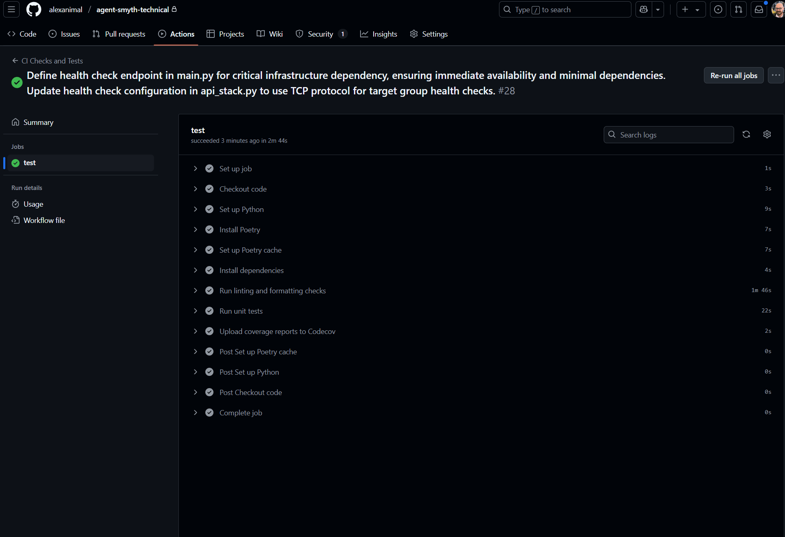
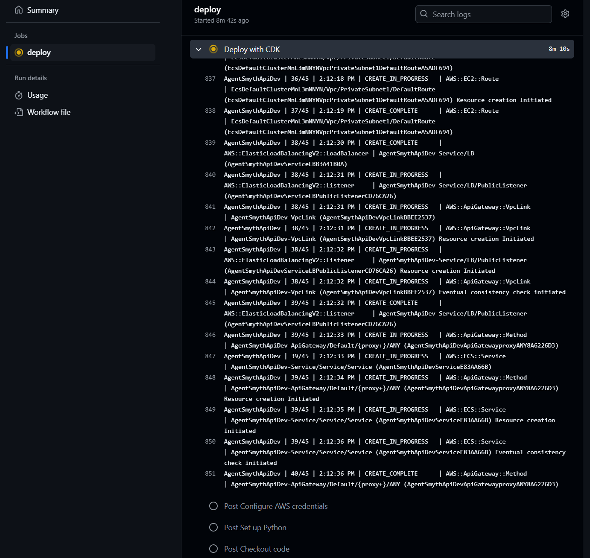
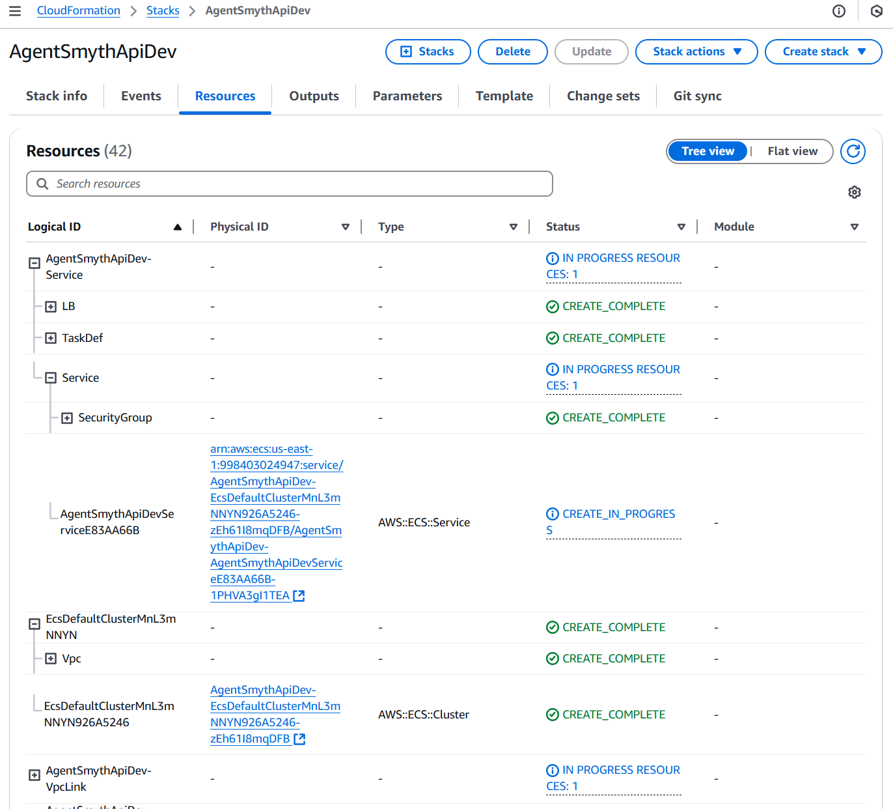
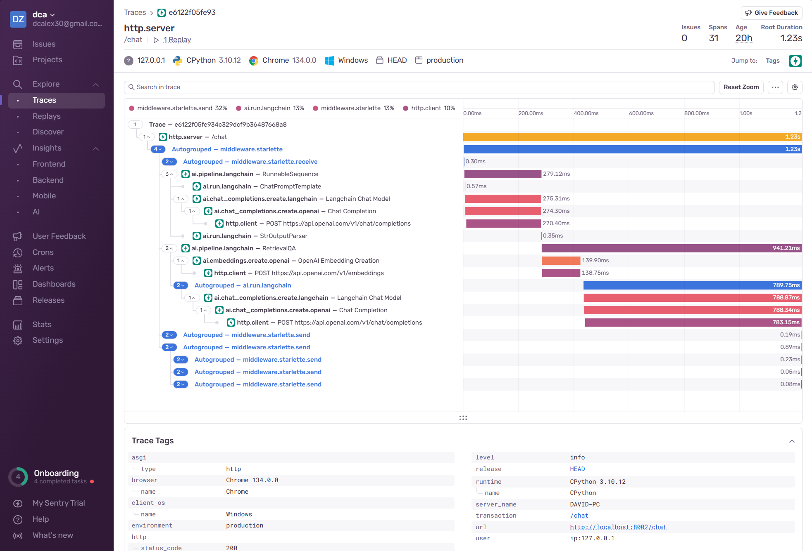
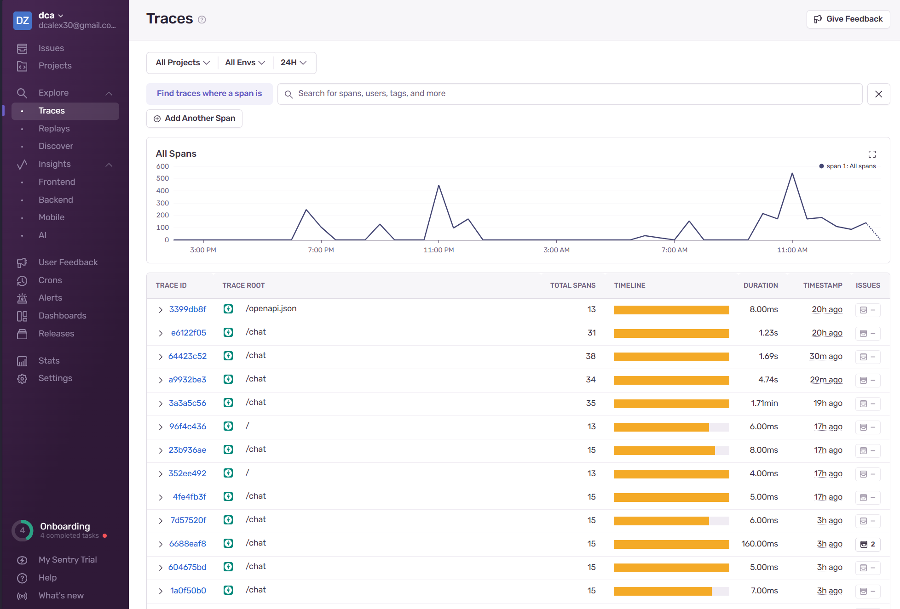
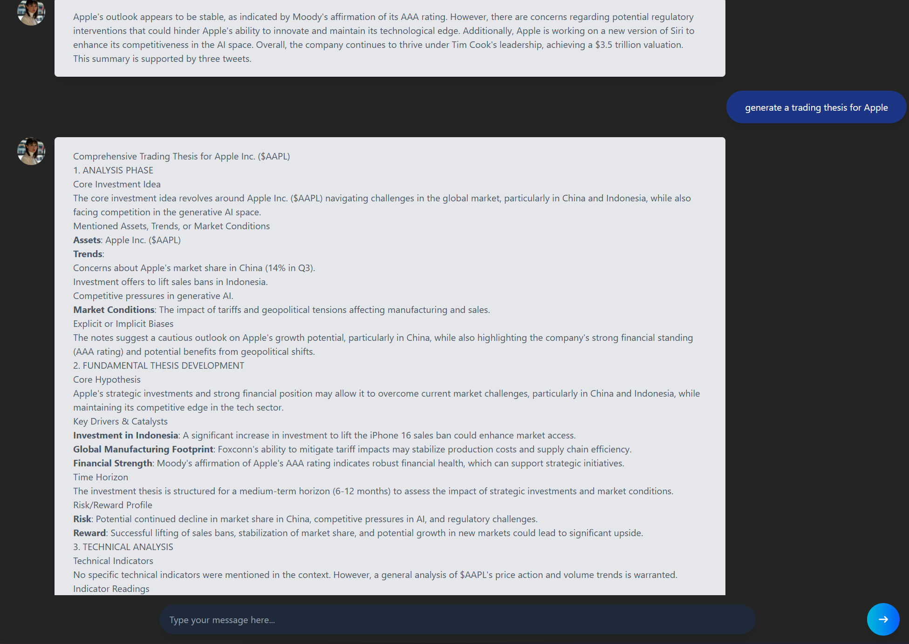

# Trading Ideas Microservice: Implementation Strategy

## Objective

Develop a microservice to generate trading ideas (long/short) for a $50 billion AUM long/short equity hedge fund portfolio manager, leveraging provided data feeds as a mini-world that captures trading signals.

## System Architecture

My implementation follows a modern microservice architecture with the following key components:

1. **RAG Knowledge Engine** - Core system for retrieving and synthesizing relevant financial insights
2. **API Layer** - FastAPI-based interface for query submission and response handling
3. **Containerized Deployment** - AWS ECS/Fargate deployment for scalability and reliability
4. **LLM Integration** - Leveraging state-of-the-art OpenAI models for analysis

## Technology Stack

- **Backend Framework**: FastAPI for high-performance API development
- **Infrastructure as Code**: AWS CDK for automated deployment
- **RAG Framework**: LangChain for orchestrating retrieval and generation
- **Vector Database**: FAISS for efficient similarity search
- **Cloud Services**: AWS ECS (Fargate), API Gateway, Network Load Balancer
- **CI/CD**: GitHub Actions for automated testing and deployment
- **Monitoring**: Sentry for error tracking and performance monitoring

## Retrieval-Augmented Generation Implementation

My RAG system follows a multi-stage process to generate high-quality trading ideas:

1. **Query Classification** - Categorize incoming queries into types (investment, technical, trading_thesis, general)
2. **Knowledge Retrieval** - Fetch relevant documents from the vector store based on query type
3. **Temporal Re-ranking** - Prioritize recent financial information (crucial for market relevance)
4. **Context Formation** - Synthesize retrieved documents into a coherent context
5. **Prompt Selection** - Choose specialized prompts based on query classification
6. **LLM Inference** - Generate nuanced trading theses with the specialized model
7. **Source Attribution** - Provide transparency by citing information sources

## Query Classification System

I implemented a query classification system that routes questions to specialized handlers:

- **Investment Queries** - Financial analysis focused on long-term value
- **Trading Thesis Queries** - Comprehensive trading ideas with entry/exit points
- **Technical Analysis Queries** - Chart patterns and technical indicator analysis
- **General Queries** - Broad market information and factual responses

This classification ensures that each query receives the most appropriate analytical treatment.

## Advanced Prompting Strategy

My microservice uses a sophisticated prompting strategy engineered to eliminate biases and provide balanced, nuanced financial analysis. This approach involves multiple components working together:

### Confidence-Based Classification

Rather than using rigid categorization, the system implements confidence-based query classification that:

- Assigns confidence scores (0-100%) to multiple categories simultaneously
- Detects mixed-intent queries that span multiple categories (30%+ in secondary category)
- Adapts retrieval depth and processing approach based on confidence distribution
- Enhances handling of nuanced financial queries that cross traditional boundaries

### Specialized Domain-Specific Prompts

I developed four specialized prompt templates optimized for different financial query types:

1. **Investment Prompts**
   - Provides nuanced position recommendations with confidence levels (0-100%)
   - Includes explicit time horizon analysis (short/medium/long-term)
   - Quantifies bullish vs. bearish signals with clear evidence ratios
   - Considers different market regimes (trending, range-bound, volatile)

2. **Trading Thesis Prompts**
   - Transforms PM notes into comprehensive trading frameworks
   - Integrates both fundamental and technical analyses
   - Prescribes precise entry/exit points with risk/reward calculations
   - Contains dedicated "Competing Hypotheses" and "Red Team Analysis" sections

3. **Technical Analysis Prompts**
   - Structured analysis of indicators (momentum, trend, volatility, volume)
   - Pattern recognition with reliability statistics
   - Multi-timeframe confirmation analysis
   - Separate bull/bear scenarios with explicit probability assignments

4. **General Knowledge Prompts**
   - Factual response generation with source attribution
   - Explicit uncertainty acknowledgment
   - Tweet-specific context utilization
   - Source quantity transparency

### Debiasing Techniques

The prompting strategy incorporates several techniques to reduce cognitive biases:

- **Probabilistic Framing**: All recommendations include explicit confidence levels
- **Counter-Narrative Generation**: Higher-temperature models generate alternative perspectives
- **Viewpoint Diversity**: Balanced representation of bullish and bearish evidence
- **Cognitive Bias Identification**: Explicit sections identifying confirmation bias, recency bias, and anchoring bias
- **Market Regime Analysis**: Considers how recommendations change under different market conditions
- **Time Horizon Diversification**: Analyzes short, medium, and long-term implications

### Multi-Temperature Strategy

The system employs different temperature settings for specialized tasks:

- **Primary Analysis**: Standard temperature (T=0) for deterministic reasoning
- **Technical Analysis**: Lower temperature (T-0.2) for precise indicator interpretation
- **Alternative Viewpoints**: Higher temperature (T+0.3) for creative, divergent thinking
- **Classification**: Zero temperature for consistent, reliable query categorization

### Adaptive Document Retrieval

The document retrieval system dynamically adjusts based on query characteristics:

- **Query Complexity**: More complex queries receive proportionally more context documents
- **Viewpoint Diversity**: Documents are selected to balance recency (70%) and sentiment diversity (30%)
- **Sentiment Analysis**: Each document receives a sentiment score to ensure balanced perspective
- **Mixed Query Handling**: Queries spanning multiple categories receive broader context

These advanced prompting strategies significantly enhance the quality and reliability of trading recommendations by systematically reducing biases, considering diverse perspectives, and providing appropriately calibrated confidence levels for financial decision-making.

## Technical Implementation Details

### Knowledge Base Processing

The processing pipeline includes:
1. Data ingestion and cleaning
2. Text chunking for optimal retrieval
3. Embedding generation using OpenAI's embedding models
4. Vector storage in FAISS for efficient similarity search

### Deployment Architecture

I deployed the service using AWS CDK with the following components:

```
┌─────────────────┐     ┌──────────────────┐     ┌───────────────┐
│  API Gateway    │────▶│  Network Load    │────▶│  ECS Fargate  │
│                 │     │  Balancer (TCP)  │     │  Service      │
└─────────────────┘     └──────────────────┘     └───────────────┘
                                                        │
                                                        ▼
                                                 ┌───────────────┐
                                                 │  Knowledge    │
                                                 │  Base (FAISS) │
                                                 └───────────────┘
```

Key deployment features:
- Containerized application for consistency across environments
- Zero-downtime deployments with min_healthy_percent=100
- Health check monitoring for system reliability
- Automatic scaling capabilities based on demand

### Health Monitoring and Reliability

I implemented several features to ensure system reliability:
- TCP health checks for container health monitoring
- Grace period configuration for proper initialization
- Sentry integration for error tracking and performance monitoring
- Structured logging for debugging and analysis

## System Implementation Screenshots

### CI/CD Pipeline

This screenshot shows our Github Actions CI/CD pipeline that automatically tests, builds, and prepares the application for deployment. The workflow includes automated unit tests, integration tests, and security scanning to ensure code quality and reliability before deployment.

### Continuous Deployment

Our continuous deployment process to AWS, showing a successful deployment of the microservice. This automated process ensures zero-downtime deployments by using a blue/green deployment strategy for the ECS Fargate service.

### Infrastructure as Code

The AWS CDK implementation defining our cloud infrastructure as TypeScript code. This approach provides consistent, version-controlled infrastructure that can be reviewed, tested, and deployed alongside the application code.

### Error Monitoring

The Sentry dashboard provides real-time visibility into application errors and exceptions. This allows us to quickly identify and resolve issues that might affect the quality of trading recommendations.

### Performance Monitoring

Performance traces showing request processing time across different components of the system. These traces help identify bottlenecks in the RAG pipeline, allowing us to optimize the retrieval and generation processes for faster response times.

### User Interface

A simple chat interface that portfolio managers can use to interact with the trading ideas API. This interface provides a conversational experience while leveraging the sophisticated RAG system in the background to generate high-quality trading recommendations.
