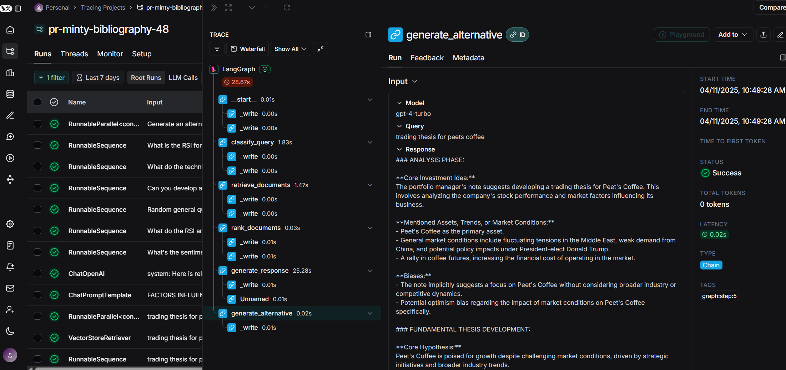
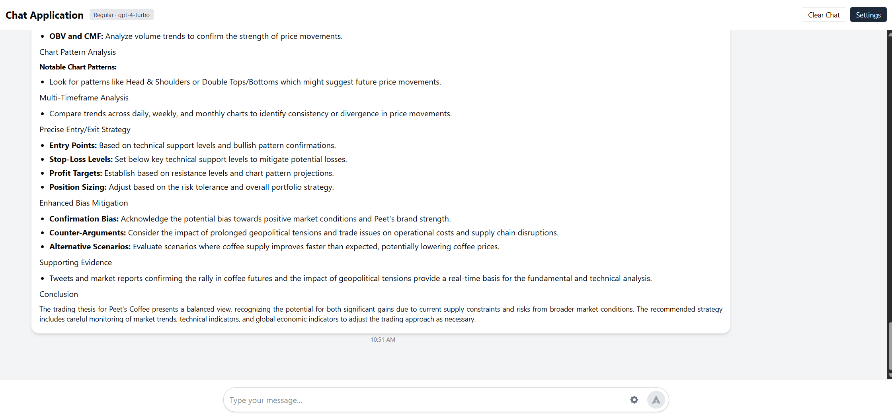

# Trading Ideas Microservice: Implementation Strategy

## Objective

Develop a microservice to generate trading ideas (long/short) for a $50 billion AUM long/short equity hedge fund portfolio manager, leveraging provided data feeds as a mini-world that captures trading signals.

## System Architecture

My implementation follows a modern microservice architecture with the following key components:

1. **RAG Knowledge Engine** - Core system for retrieving and synthesizing relevant financial insights
2. **API Layer** - FastAPI-based interface for query submission and response handling
3. **Containerized Deployment** - AWS ECS/Fargate deployment for scalability and reliability
4. **LLM Integration** - Leveraging state-of-the-art OpenAI models for analysis

## Technology Stack

- **Backend Framework**: FastAPI for high-performance API development
- **Infrastructure as Code**: AWS CDK for automated deployment
- **RAG Framework**: LangChain for orchestrating retrieval and generation
- **Vector Database**: FAISS for efficient similarity search
- **Cloud Services**: AWS ECS (Fargate), API Gateway, Network Load Balancer
- **CI/CD**: GitHub Actions for automated testing and deployment
- **Monitoring**: Sentry for error tracking and performance monitoring

## Retrieval-Augmented Generation Implementation

My RAG system follows a multi-stage process to generate high-quality trading ideas:

1. **Query Classification** - Categorize incoming queries into types (investment, technical, trading_thesis, general)
2. **Knowledge Retrieval** - Fetch relevant documents from the vector store based on query type
3. **Temporal Re-ranking** - Prioritize recent financial information (crucial for market relevance)
4. **Context Formation** - Synthesize retrieved documents into a coherent context
5. **Prompt Selection** - Choose specialized prompts based on query classification
6. **LLM Inference** - Generate nuanced trading theses with the specialized model
7. **Source Attribution** - Provide transparency by citing information sources

### Social Signal Enhanced Ranking System

Our latest enhancement incorporates social engagement metrics to improve document ranking relevance:

- **Multi-factor Ranking Algorithm** - Documents are scored based on a weighted combination of:
  - **Recency** - Timestamp-based scoring that prioritizes recent information
  - **Likes** - Reflecting content's perceived value by financial community
  - **Retweets/Shares** - Measuring amplification of information by experts
  - **Views** - Capturing broader attention and importance

- **Query-Adaptive Weighting** - Weights are dynamically adjusted based on query type:
  - **Investment Queries**: {recency: 0.3, views: 0.2, likes: 0.2, retweets: 0.3}
  - **Technical Analysis**: {recency: 0.5, views: 0.1, likes: 0.2, retweets: 0.2}
  - **General Queries**: {recency: 0.4, views: 0.2, likes: 0.2, retweets: 0.2}

- **Diversity Optimization** - Final document selection employs a diversity factor (0.3) to ensure:
  - Balanced viewpoints (bullish/bearish)
  - Varied information sources
  - Different temporal perspectives
  - Representation of both high-engagement and potentially overlooked content

- **Configurable Ranking** - System accepts custom ranking configurations through the API, allowing portfolio managers to adjust document selection criteria based on their specific needs

This enhanced ranking approach significantly improves the quality of generated trading ideas by ensuring the most relevant, socially validated, and temporally significant information is prioritized while maintaining diverse perspectives.

### Enhanced Error Handling and Robustness

Our latest updates have significantly improved the system's reliability through:

- **Robust Timestamp Validation** - Comprehensive handling of invalid timestamp formats (None values, non-numeric strings, invalid types) in document metadata
- **Graceful Fallback Mechanisms** - When primary ranking fails, the system falls back to simpler timestamp-based sorting
- **Empty Result Handling** - Explicit handling for cases where no valid documents remain after filtering
- **Type-Safe Implementation** - Improved type safety using Python's typing system and cast() functions for TypedDict operations
- **Comprehensive Logging** - Enhanced error logging with detailed context for easier debugging and monitoring

These improvements ensure that the system continues to function even when encountering problematic data or edge cases, providing a more reliable service to portfolio managers.

## Query Classification System

I implemented a query classification system that routes questions to specialized handlers:

- **Investment Queries** - Financial analysis focused on long-term value
- **Trading Thesis Queries** - Comprehensive trading ideas with entry/exit points
- **Technical Analysis Queries** - Chart patterns and technical indicator analysis
- **General Queries** - Broad market information and factual responses

This classification ensures that each query receives the most appropriate analytical treatment.

## Advanced Prompting Strategy

My microservice uses a sophisticated prompting strategy engineered to eliminate biases and provide balanced, nuanced financial analysis. This approach involves multiple components working together:

### Confidence-Based Classification

Rather than using rigid categorization, the system implements confidence-based query classification that:

- Assigns confidence scores (0-100%) to multiple categories simultaneously
- Detects mixed-intent queries that span multiple categories (30%+ in secondary category)
- Adapts retrieval depth and processing approach based on confidence distribution
- Enhances handling of nuanced financial queries that cross traditional boundaries

### Specialized Domain-Specific Prompts

I developed four specialized prompt templates optimized for different financial query types:

1. **Investment Prompts**
   - Provides nuanced position recommendations with confidence levels (0-100%)
   - Includes explicit time horizon analysis (short/medium/long-term)
   - Quantifies bullish vs. bearish signals with clear evidence ratios
   - Considers different market regimes (trending, range-bound, volatile)

2. **Trading Thesis Prompts**
   - Transforms PM notes into comprehensive trading frameworks
   - Integrates both fundamental and technical analyses
   - Prescribes precise entry/exit points with risk/reward calculations
   - Contains dedicated "Competing Hypotheses" and "Red Team Analysis" sections

3. **Technical Analysis Prompts**
   - Structured analysis of indicators (momentum, trend, volatility, volume)
   - Pattern recognition with reliability statistics
   - Multi-timeframe confirmation analysis
   - Separate bull/bear scenarios with explicit probability assignments

4. **General Knowledge Prompts**
   - Factual response generation with source attribution
   - Explicit uncertainty acknowledgment
   - Tweet-specific context utilization
   - Source quantity transparency

### Debiasing Techniques

The prompting strategy incorporates several techniques to reduce cognitive biases:

- **Probabilistic Framing**: All recommendations include explicit confidence levels
- **Counter-Narrative Generation**: Higher-temperature models generate alternative perspectives
- **Viewpoint Diversity**: Balanced representation of bullish and bearish evidence
- **Cognitive Bias Identification**: Explicit sections identifying confirmation bias, recency bias, and anchoring bias
- **Market Regime Analysis**: Considers how recommendations change under different market conditions
- **Time Horizon Diversification**: Analyzes short, medium, and long-term implications

### Multi-Temperature Strategy

The system employs different temperature settings for specialized tasks:

- **Primary Analysis**: Standard temperature (T=0) for deterministic reasoning
- **Technical Analysis**: Lower temperature (T-0.2) for precise indicator interpretation
- **Alternative Viewpoints**: Higher temperature (T+0.3) for creative, divergent thinking
- **Classification**: Zero temperature for consistent, reliable query categorization

### Adaptive Document Retrieval

The document retrieval system dynamically adjusts based on query characteristics:

- **Query Complexity Adaptation** - More complex queries (technical, mixed-intent) receive proportionally more context documents:
  - Standard queries: Base k documents
  - Complex queries: Increased document count (up to 50% more for specialized analysis)
  - Mixed-intent queries: Broader coverage across topics (minimum 5 additional documents)

- **Multi-stage Retrieval Pipeline**:
  1. **Initial Oversampling** - Retrieves 3x the final required documents to ensure diversity
  2. **Social Signal Scoring** - Applies the multi-factor ranking algorithm (recency, likes, retweets, views)
  3. **Viewpoint Balancing** - Documents are selected to balance recency (70%) and sentiment diversity (30%)
  4. **Result Diversification** - Final selection optimized for information diversity using clustering techniques

- **Metadata-Aware Processing** - Retrieval parameters incorporate document metadata:
  - **Temporal Analysis** - Adjusts recency weighting based on query time horizon implications
  - **Engagement Significance** - For trending topics, engagement signals receive higher weights
  - **Source Verification** - Prioritizes verified sources for critical financial information

- **Failover Protection** - If sophisticated ranking fails, system gracefully degrades to simpler recency-based sorting while maintaining functionality

This adaptive retrieval approach ensures that the system delivers both highly relevant information (through social signal ranking) and diverse perspectives (through diversification algorithms), resulting in more comprehensive trading recommendations that portfolio managers can confidently act upon.

These advanced prompting strategies significantly enhance the quality and reliability of trading recommendations by systematically reducing biases, considering diverse perspectives, and providing appropriately calibrated confidence levels for financial decision-making.

## Technical Implementation Details

### LangGraph Implementation

Our most significant architectural improvement has been migrating our RAG pipeline to a LangGraph-based workflow:

- **Node-Based Architecture** - The RAG pipeline is now structured as a directed graph with specialized nodes:
  - `classify_query_node` - Determines query intent and confidence distribution
  - `retrieve_documents_node` - Handles vector database retrieval with dynamic parameters
  - `rank_documents_node` - Applies social signal scoring and diversity optimization
  - `generate_response_node` - Produces the primary response with source attribution
  - `generate_alternative_node` - Creates counterarguments for balanced analysis

```
┌───────────────────┐
│                   │
│  User Query       │
│                   │
└─────────┬─────────┘
          │
          ▼
┌─────────────────────┐
│                     │
│  classify_query_node│
│                     │
└─────────┬───────────┘
          │
          ▼
┌─────────────────────┐
│                     │
│retrieve_documents_  │
│       node          │
└─────────┬───────────┘
          │
          ▼
┌─────────────────────┐
│                     │
│  rank_documents_    │
│       node          │
└─────────┬───────────┘
          │
          ▼
┌─────────────────────┐      ┌─────────────────────┐
│                     │      │                     │
│  generate_response_ ├──────►  generate_          │
│       node          │      │  alternative_node   │
│                     │      │                     │
└─────────┬───────────┘      └─────────┬───────────┘
          │                            │
          ▼                            ▼
┌───────────────────┐      ┌────────────────────┐
│  Primary Response │      │ Alternative        │
│  with Sources     │      │ Viewpoint          │
└───────────────────┘      └────────────────────┘
```

- **State Management Benefits**
  - **Typed State Schema** - TypedDict-based state validation ensures data integrity throughout the workflow
  - **Immutable State Transitions** - Each node receives and returns a complete state object, improving debuggability
  - **Explicit Dependency Graph** - Clear visualization of information flow and component relationships
  - **Conditional Execution Paths** - Routes queries through specialized processing branches based on classification

- **Enhanced Testability**
  - **Isolated Node Testing** - Each functional component can be independently unit tested
  - **State Snapshot Verification** - Easy assertion of state transformations at each pipeline stage
  - **Mock Integration** - Simplified testing with standardized node input/output interfaces
  - **Failure Injection** - Targeted introduction of errors to validate robustness

- **Observability Improvements**
  - **Execution Tracing** - Detailed step-by-step tracking of state transformations
  - **Performance Profiling** - Per-node timing metrics for identifying bottlenecks
  - **State Inspection** - Runtime visibility into intermediate results
  - **Metrics Collection** - Automatic generation of operational statistics

- **Deployment Flexibility**
  - **Parallel Execution** - Independent nodes can be executed concurrently
  - **Serverless Compatibility** - Graph structure maps naturally to event-driven architectures
  - **Incremental Updates** - Individual nodes can be improved without rebuilding entire pipeline
  - **A/B Testing** - Multiple graph variants can run simultaneously to evaluate improvements

This graph-based architecture has significantly enhanced the maintainability, reliability, and extensibility of our trading ideas service, while providing clearer visibility into the reasoning process that generates recommendations.

### Knowledge Base Processing

The processing pipeline includes:
1. Data ingestion and cleaning
2. Text chunking for optimal retrieval
3. Embedding generation using OpenAI's embedding models
4. Vector storage in FAISS for efficient similarity search

### Deployment Architecture

I deployed the service using AWS CDK with the following components:

```
┌─────────────────┐     ┌──────────────────┐     ┌───────────────┐
│  API Gateway    │────▶│  Network Load    │────▶│  ECS Fargate  │
│                 │     │  Balancer (TCP)  │     │  Service      │
└─────────────────┘     └──────────────────┘     └───────────────┘
                                                        │
                                                        ▼
                                                 ┌───────────────┐
                                                 │  Knowledge    │
                                                 │  Base (FAISS) │
                                                 └───────────────┘
```

Key deployment features:
- Containerized application for consistency across environments
- Zero-downtime deployments with min_healthy_percent=100
- Health check monitoring for system reliability
- Automatic scaling capabilities based on demand

### Health Monitoring and Reliability

I implemented several features to ensure system reliability:
- TCP health checks for container health monitoring
- Grace period configuration for proper initialization
- Sentry integration for error tracking and performance monitoring
- Structured logging for debugging and analysis
- Comprehensive exception handling to ensure graceful degradation
- Type-safe implementation with proper validation of external data

These reliability features ensure the system can handle edge cases gracefully, maintaining service availability even when encountering problematic data or unexpected situations. Our latest updates have significantly improved error handling throughout the RAG pipeline, particularly in document processing and ranking components.

## Enhanced Testing Strategy

Our latest updates include a more comprehensive testing strategy:

- **Edge Case Coverage** - Tests for invalid data formats, empty result sets, and other edge cases
- **Mock-Based Testing** - Advanced mocking techniques for isolated component testing
- **Failure Mode Testing** - Explicit tests for fallback behavior when primary mechanisms fail
- **Type Checking** - Static type analysis for early error detection

## System Implementation Screenshots

### CI/CD Pipeline

This screenshot shows our Github Actions CI/CD pipeline that automatically tests, builds, and prepares the application for deployment. The workflow includes automated unit tests, integration tests, and security scanning to ensure code quality and reliability before deployment.

### Continuous Deployment

Our continuous deployment process to AWS, showing a successful deployment of the microservice. This automated process ensures zero-downtime deployments by using a blue/green deployment strategy for the ECS Fargate service.

### Infrastructure as Code

The AWS CDK implementation defining our cloud infrastructure as TypeScript code. This approach provides consistent, version-controlled infrastructure that can be reviewed, tested, and deployed alongside the application code.

### Error Monitoring

The Sentry dashboard provides real-time visibility into application errors and exceptions. This allows us to quickly identify and resolve issues that might affect the quality of trading recommendations.

### Performance Monitoring

Performance traces showing request processing time across different components of the system. These traces help identify bottlenecks in the RAG pipeline, allowing us to optimize the retrieval and generation processes for faster response times.

### LangGraph Workflow Visualization

The LangGraph dashboard provides a real-time visualization of our RAG workflow execution. This interactive view shows the flow of information through each node, the state transformations at each step, and performance metrics for individual components. It's an invaluable tool for debugging, optimization, and explaining the system's decision-making process to stakeholders.

### User Interface

A simple chat interface that portfolio managers can use to interact with the trading ideas API. This interface provides a conversational experience while leveraging the sophisticated RAG system in the background to generate high-quality trading recommendations.
